# 架构

simplescale的时序图：

*注：Resource表示一种具体的workload，可以是deployment,也可以是statefulset,application等*

simplescale工作时序架构：
- Promethues 从 Resource 采集自定义指标
- RecommendationScaleFactor Controller 从 RecommendationScaleFactor CRD 读取查询语句(PromSQL)
- RecommendationScaleFactor Controller 从 Promethues 查询所需数据
- RecommendationScaleFactor Controller 从 RecommendationScaleFactor CRD 读取指标目标值（比如cpu使用率70%）
- RecommendationScaleFactor Controller 对比从 Promethues 获取的当前值和RecommendationScaleFactor CRD 读取指标目标值，通过两者的比值计算出资源扩缩容比值，更新回 RecommendationScaleFactor CRD。
- SimpleAutoscaler Controller 从 RecommendationScaleFactor CRD 中读取扩缩容比值。
- SimpleAutoscaler Controller 基于策略规则判断是否需要对目标资源执行扩缩容行为
- 如果满足条件，更新目标资源，同时更新 SimpleAutoscaler CRD